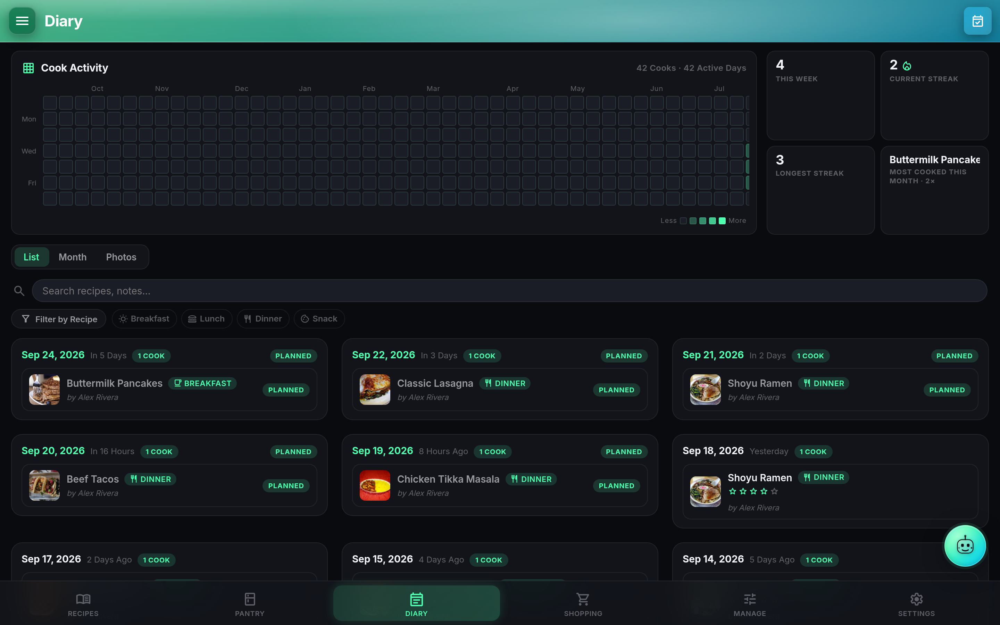
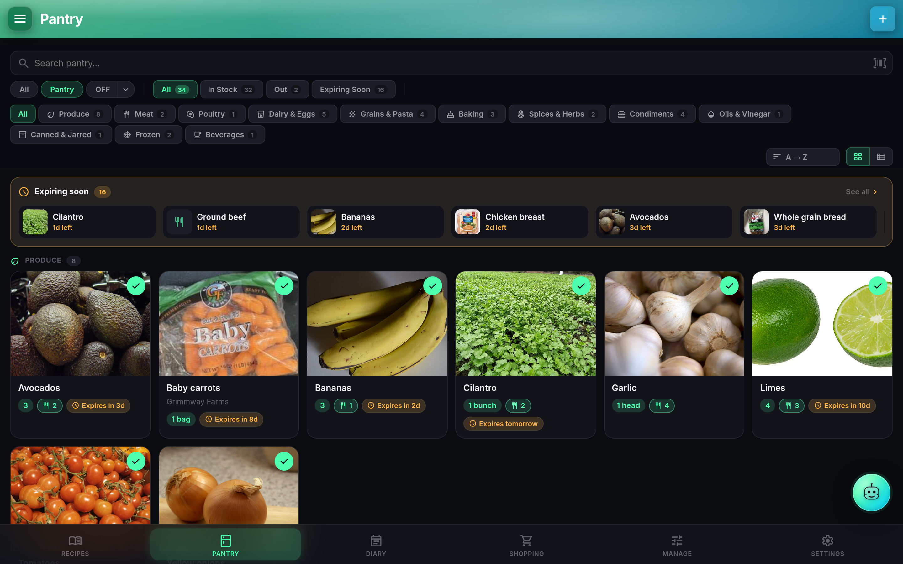
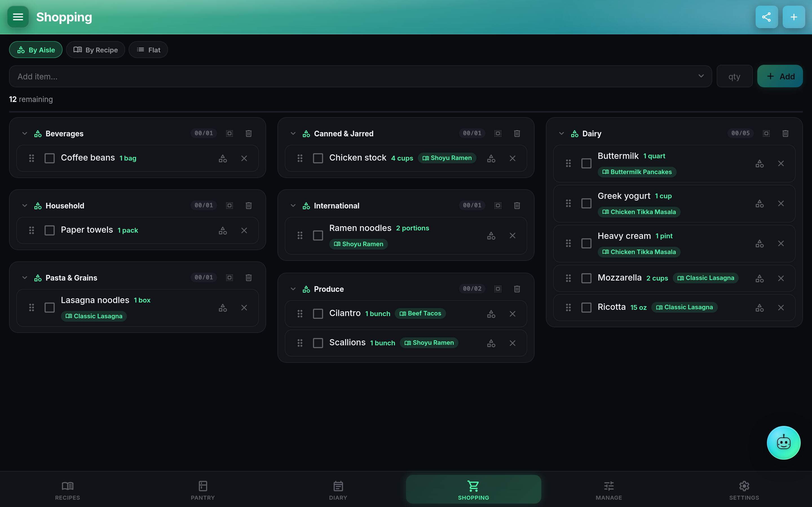

# Feature tour

A guided walkthrough of the main flows in CookTrace. Each section anchors so you can deep-link.

## Browse recipes {#browse}

The Recipes page is a grid of cards by default, with a List toggle for denser scans. Each card shows the hero image, name, star rating, favorite heart, cook count, prep/cook times, category badge, and a "pantry match" pill that says how many of the recipe's ingredients are currently in stock. The pill is variant-aware, so a recipe that calls for "milk" matches whichever brand of milk your pantry actually holds.

Three tabs across the top: **Recipes** (yours), **Shared** (recipes another user has granted you or that fan out from a Kitchen), and **Cookbooks**. The Shared tab shows a `via_kitchen_id` chip when the grant came through a Kitchen. A per-user setting under Settings > Cooking optionally blends shared recipes into the main list.

Search is instant client-side. Long-press any card for a context menu (Cook Now, Add to Cookbook, Share, Print, Delete).

## Cook a recipe {#cook}

Tap into a recipe and the view lays out in three columns above 1280px, two between 960 and 1279, and stacks below. Left column is Ingredients (sticky as you scroll), middle is Steps and Notes, right is Nutrition. A print stylesheet drops the chrome for a clean paper copy.

Tap **Cook Mode** to enter a distraction-free view with larger type. The Screen Wake Lock keeps the display on, and re-acquires when you tab away and come back. Ingredient and step checkboxes are device-local by design (they live in `localStorage` as `ct:checks:<recipeId>:ing|step`), so ticking off "onions" on your phone doesn't tick them off on the tablet mounted above the stove.

An embedded timer rail sits inline in the cook-mode bar. Duration mentions in step text (things like "simmer for 15 minutes") get parsed into inline **timer chips** you can tap to start. Running timers persist across reloads via the `cookTimers` store, ring a WebAudio chime plus a browser notification, and let you snooze or add a minute from the floating pill.

When you're done, tap **Log this cook** to write a Cook Log entry with date, meal type, per-cook rating, optional notes, and up to a few photos.

## Live scaling and unit conversion

Chips above the ingredient list let you scale ×0.5 / ×1 / ×2 / ×3, or set a custom serving count. Quantities re-render as clean fractions (`¼ cup` not `0.25 cup`) via the fraction snapper in `src/lib/qty.js`.

Each ingredient row has an inline unit converter that draws on a 37-unit catalog and a 250-entry density table for volume-to-grams jumps. Missing a density? Recompute From Pantry surfaces a "Set N g/cup" chip inline so you can fill in the gap once and move on.

## Plan the week {#plan}

The Diary page has a list view (60 days back, 30 days forward, grouped by date) and a month calendar. Drag a recipe between calendar cells to reschedule it. Planned cooks are grey; a one-tap toggle promotes them to logged cooks and records the date.

A **heatmap** at the top of the page shows cook density over the last year (contribution-graph style). Click a cell to jump to that day's entries.

## Stock the pantry {#pantry}

The Pantry page mirrors Recipes: grid or list, per-user preference. Tap an item and a **slide-up details sheet** covers the lower half of the screen with hero, brand, category, barcode, stock pill, serving size, on-hand quantity, expiration date, and nutrition. Hit Edit to swap that same layout into inputs, no navigation to a separate editor.

Add items three ways:

- Manually, from the Add Item button.
- By **barcode**: the built-in scanner uses ML Kit on Android and QuaggaJS in the browser. Scans hit Open Food Facts first, then USDA if you have a key configured, and pre-fill nutrition.
- From a recipe you're saving, when **Auto-Add Ingredients to Pantry** is on (off by default).

**Variants** let a parent pantry item ("Milk") carry brand-specific children ("Oatly Barista"). Recipe ingredient links can point at the parent, in which case any in-stock variant satisfies the match. Nesting stops at one level; the server rejects three-deep hierarchies.

Expiration works two ways: a chip on the item card (Expiring Soon, Expired) and an **Expiration Digest** notification that fires at a chosen time of day, N days before, via whichever push provider you've configured.

## Shop from the plan {#shop}

Open a recipe and hit **Add to Shopping** to push its ingredients onto the list, skipping anything already stocked. Or open Diary, select a date range, and **Shop This Plan** fans every planned recipe's ingredients out at once, dedupping across recipes (buy one bag of flour, not three).

The list groups **By Aisle** by default (aisle comes from the linked pantry item's category), with By Recipe and Flat as alternatives. Checked items either sink to the bottom or hide entirely, per-user preference. Drag to reorder within a group, and the sort persists.

Bulk clear removes everything you've checked in one shot. Adding the same ingredient from a second recipe merges into the existing row instead of stacking duplicates.

## Share and export

Every recipe has a **Share** dialog with per-user grants ("share with Alice") and, separately, a public read-only link (`/r/<token>`) that anyone can open without logging in. Kitchens fan grants out to whole groups. A Pinterest-style **card image** is available for social sharing via `/api/recipes/:id/card.png`.

Full instance backups (admin only) zip the DB and uploads together. Portable JSON export is per-user and images-free, useful for phone-to-phone or account-to-account moves. See [Import and migration](import.md) for the incoming side.

## Cook and shop without a connection {#offline}

The web app keeps working when the signal drops, in a browser tab or installed as an app, and comes back up offline after a reload. A supermarket with no signal is the case it is built for.

- **What works offline**: your shopping list (adding items, ticking them off, editing, removing, clearing what you ticked, reordering); the pantry (adding, editing, removing, marking in or out of stock); the cook diary; your recipes and the notes you leave on them; and settings. Reading works for anything this browser has already seen: recipes with their pictures, cookbooks, the pantry, the diary and your units.

### What does not work offline

These need your server or the internet, and say so plainly rather than failing quietly:

| Not available offline | Why |
| --- | --- |
| Adding a photo to a recipe or a pantry item | The file has to reach your server |
| Importing recipes (a URL, a file, Mealie, Paprika, a zip) | It reads from the internet or your server |
| Sharing a recipe or a cookbook, share links | Sharing decides who can see your food, so it is never done from a list pulled down hours ago |
| Kitchens: creating one, adding or removing members | Same reason |
| Trace, and anything that asks an AI | It talks to an AI provider |
| Backups, export, API tokens, webhooks | They move data in or out of your server |
| Admin: users, invites, server settings, updates | They change your server |
| Signing in, or signing up a new account | The sign-in screen needs your server |

A recipe, pantry item or picture this browser has never seen is not there offline either: nothing is fetched in the background for later, so open what you plan to cook from before you lose signal.

The menu button shows an amber cloud while anything is waiting. What you change is kept in the browser, so it survives closing the tab, and it goes up on its own when the connection returns, as the very requests the app made, so your server does exactly what it would have done anyway. Two tabs cannot send it twice, and nothing is sent while you are offline: the queue is cleared only once your server has confirmed it.

If your server refuses one of your changes when it finally reaches it, that one change is set aside and named in plain words ("Your server would not accept the item you added to your shopping list: ..."), everything else queued behind it still goes up, and the reason is written to the diagnostics log. A server that is merely busy, or a session that has expired, is retried instead, so nothing is thrown away because a cookie timed out.

Signing out sends what is waiting first, then clears this browser's copy. If it cannot reach your server, it asks before discarding anything.

This is not built on Background Sync, which Safari does not have, so an iPhone behaves the same as everything else. The Android app is unaffected: it has its own offline story in local mode.

## Related

- [Recipes deep dive](recipes.md)
- [Pantry deep dive](pantry.md)
- [Cook Diary and Meal Planner](diary.md)
- [Trace AI in CookTrace](trace.md)
