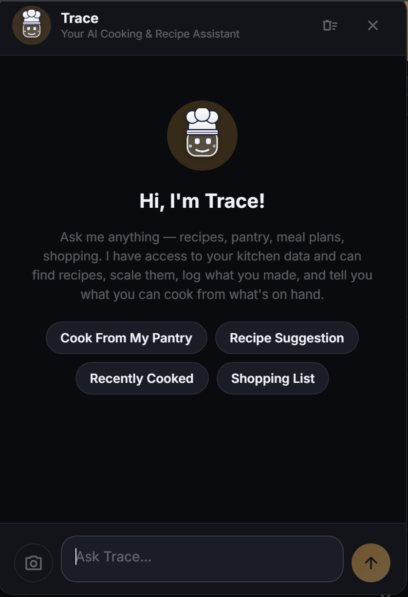

# Trace in CookTrace

Trace is the AI assistant shared across the TraceApps family (CookTrace, LiftTrace, NutriTrace). Same persona, same setup surface, different tools per app. In CookTrace, Trace focuses on cooking: your recipes, your pantry, your diary, your shopping list.

The provider and key setup is identical across the three apps and lives on a shared page: see [Trace setup](../trace/setup.md) for cloud providers, [Local LLM](../trace/local-llm.md) for Ollama and friends, and [Models](../trace/models.md) for what to pick when.

## The chef-hat mascot

The floating chat FAB opens the Trace panel. In CookTrace, the TraceFace mascot wears a chef's hat by default (`TraceFaceChef.svelte`). Toggle under Settings > AI Assistant > Chef Hat if you'd rather keep it plain.

## Tools Trace can call

CookTrace registers 19 tools that Trace can call in a single conversation, spanning read and write across the app:

**Read**

- `get_recipes`: filtered list of your recipes.
- `list_recipe_categories`: categories with counts.
- `get_recipe`: full detail of one recipe (ingredients, steps, nutrition).
- `get_pantry`: your pantry with stock and expiration.
- `list_pantry_categories`: pantry categories with counts.
- `find_recipes_from_pantry`: matches your in-stock pantry against your recipe library.
- `get_diary`: cook diary entries, filterable by date range and kind.
- `get_shopping_list`: current shopping list.
- `get_cookbooks`: your cookbook list.
- `get_cookbook`: recipes inside one cookbook.

**Write**

- `log_cook`: record that you cooked a recipe (date, meal type, rating, notes).
- `plan_cook`: schedule a recipe for a future date.
- `add_to_shopping`: push items onto the shopping list.
- `add_to_pantry`: create a pantry item.
- `set_pantry_density`: set `g_per_cup` so nutrition can convert cross-family.
- `set_pantry_stock`: mark an item in/out of stock or set a quantity.
- `add_to_cookbook`: put a recipe into a cookbook.
- `import_recipe_from_url`: scrape and save a URL.
- `create_recipe`: build a new recipe from a structured payload (used by the photo-import flow).

Trace picks tools per turn based on the conversation. Multi-tool turns are common ("check pantry, find recipes that match, plan one for Wednesday, add missing items to shopping").

## Smart Log

Hold the FAB to record voice via the Web Speech API. The transcript drops into the chat input for you to review, then send. Handy when your hands are messy from cooking and typing is out. Toggle under Settings > AI Assistant > Smart Log.

## Image attach

The paperclip in the chat panel attaches an image (camera or file picker). Trace receives it in the provider's native multimodal format. Useful for:

- **Label recognition** on a pantry item you just bought: "add this to pantry", and Trace fills brand, category, serving size, nutrition from the label.
- **Handwritten recipe cards**: attach the photo, ask Trace to create a recipe, review the parsed result before saving.
- **Screenshots** of a recipe you saw somewhere: paste and let Trace extract.

## Persistent chat history

Chat turns persist per-user in the `ai_chat_history` table. The last 100 turns load on Trace open so context carries across sessions. Clear from the panel menu.

## Provider-agnostic setup

Trace works with:

- **Anthropic Claude** (default provider on new installs).
- **OpenAI** (`gpt-4o-mini`, `gpt-4o`, custom).
- **Google Gemini** (`gemini-2.5-flash` and friends; retired 1.5 and 2.0 IDs auto-remap at request time).
- **OpenAI Compatible** for Ollama, LM Studio, LocalAI, vLLM, llama.cpp, DeepSeek, Groq, Together AI, and OpenRouter.

Choose your provider under Settings > AI Assistant. The **Custom model** sentinel (`__custom__`) lets you type any model ID for Claude, OpenAI, or Gemini when the preset list gets stale. When the operator locks the AI config via `AI_*` env vars, the UI fields disable and Trace calls proxy through `POST /api/ai/chat` so the browser never sees the key. See [Trace setup](../trace/setup.md) for the full walkthrough.

## Sample prompts to try

- "What can I make from what's in the pantry right now?"
- "Import this recipe: https://example.com/best-pasta"
- "Plan dinner for next Monday to Friday, keep it under 45 minutes each night, and build the shopping list."
- "I just cooked the roast chicken, rating 5, notes 'brined 24h next time'."
- "Add oat milk, sourdough, and lemons to the shopping list."
- "The pantry doesn't know how many grams a cup of my rolled oats is; it's about 90g/cup, set that."
- (with a photo of a spice jar) "Add this to pantry, category Spices."

## Related

- [Trace setup](../trace/setup.md)
- [Local LLM options](../trace/local-llm.md)
- [Model picker](../trace/models.md)
- [Import via Trace](import.md)
