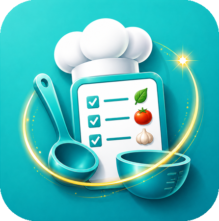
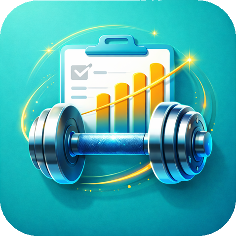
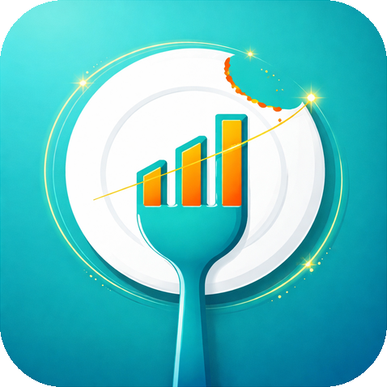

---
hide:
  - navigation
  - toc
---

# TraceApps

Three self-hosted trackers. One design language. Your data on your hardware.

TraceApps is a family of three single-container self-hosted apps. They share the same install story, the same on-device AI assistant ("Trace"), the same data-stays-on-your-hardware principles, and the same Android companion model. Pick the app you want. The shared setup pages here (Docker install, OIDC, Trace AI, backups, mobile) are written once and apply to all three.

-   { width="120" .app-card-icon }

    **CookTrace**

    Recipes, pantry, cook mode. Meal plan and grocery-list your week.

    [:octicons-arrow-right-24: CookTrace docs](cooktrace/index.md)

-   { width="120" .app-card-icon }

    **LiftTrace**

    Track every rep, set, and PR. Programs, progressions, coaching.

    [:octicons-arrow-right-24: LiftTrace docs](lifttrace/index.md)

-   { width="120" .app-card-icon }

    **NutriTrace**

    Food diary, adaptive calorie goals, wearable-informed wellness.

    [:octicons-arrow-right-24: NutriTrace docs](nutritrace/index.md)

## New here?

Start with **[Get Started → Install with Docker Compose](getting-started/compose.md)**. One page covers all three apps with per-app tabs.

If you already have one Trace app running and want to add another, jump to **[How the three apps compare](self-hosting/compare.md)** for the volume, port, and base-image differences.

## Shared plumbing

Written once, applies to all three:

- **[Trace AI](trace/setup.md)** covers Claude, OpenAI, Gemini, and local models. Same setup surface across apps.
- **[Authentication](auth/oidc.md)** covers local users plus full OIDC/SSO recipes for Authentik, Keycloak, Pocket-ID, Authelia, Google, and Auth0.
- **[Backups and restore](self-hosting/backups.md)** covers three layers: volume copy, in-app full-backup ZIP, and portable JSON export.
- **[Mobile app](mobile/install.md)** covers install, keystore, sync model, and the server-connected vs local mode picker.
- **[Environment reference](self-hosting/env-vars.md)** lists every env var across all three apps in one comparison table.

## Principles

- **Self-hosting is free and always will be.** Server, PWA, and source never paywalled.
- **No telemetry.** None of the apps phone home.
- **Your data, your hardware.** SQLite files plus an uploads folder. Back up with `cp`, restore with `cp`.
- **[AGPL-3.0](https://www.gnu.org/licenses/agpl-3.0.html).** The network-use clause keeps it that way.

---

<small>Source: [github.com/TraceApps/docs](https://github.com/TraceApps/docs) · Apps: [CookTrace](https://github.com/TraceApps/cooktrace) · [LiftTrace](https://github.com/TraceApps/lifttrace) · [NutriTrace](https://github.com/TraceApps/nutritrace)</small>
