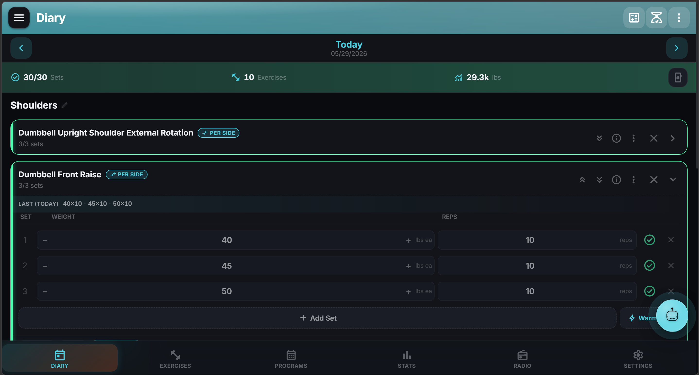

# LiftTrace

LiftTrace is a self-hosted weightlifting tracker. One Docker container, one SQLite file, one uploads directory. A PWA for the browser and an optional Android app that can run fully offline or sync back to your server. No cloud accounts, no telemetry, no paid tier gating things you already own. AGPL-3.0.

The short version: log every workout, follow a real program, watch PRs happen, and get an AI coach that actually knows what you lifted last Tuesday, all without handing your training data to a company that might get bought, shut down, or start charging next quarter. If you already run a home server (Jellyfin, Nextcloud, Home Assistant, Navidrome), LiftTrace slots in next to them the same way.

## Where it fits

Compared to the popular alternatives:

- **Strong** and **Hevy** are polished commercial apps with cloud sync and premium tiers. If you want zero setup and are fine paying a monthly fee and trusting a vendor, they are the easier choice. LiftTrace trades that for full data ownership, no subscription, and integrations that only make sense when you run your own infrastructure (SSO, music-server playback, federation with a self-hosted nutrition tracker).
- **FitNotes** is beloved on Android for being simple and offline-only. LiftTrace's Local mode covers the same ground, and adds a server side if you want programs, PRs, and history shared across devices.
- **Jefit** and **Fitbod** lean on their own program libraries and AI coaching baked into a paid plan. LiftTrace lets you plug in your own AI provider (Claude, OpenAI, Gemini, or any OpenAI-compatible endpoint including a local Ollama or LM Studio) and skips the paywall entirely.

Not "better than". Different trade-offs. If you already `docker compose up` things on your own hardware, LiftTrace is aimed at you.

## What you get

- Full workout diary with per-set weight, reps, RPE, warm-ups, supersets, and a persistent rest timer.
- Smart Log parser that turns `bench 3x5 @ 225, A1: curls 3x12 @ 30` into structured sets, available as a text field or a hold-to-record voice gesture on the Trace FAB.
- Programs and templates including multi-week progression blocks with per-week Sets, Reps, Tempo, Rest, and Load matrices.
- Exercise library with four sources (wger, Free Exercise DB, ExerciseDB via RapidAPI, and ExerciseDB open-source mirror), plus custom exercises and XLSX bulk import.
- Trace AI coach with live workout context injected on every message.
- Radio player for Subsonic-compatible servers, Jellyfin, Plex, Emby, and internet radio (Icecast, Shoutcast, HLS).
- OIDC SSO for Authentik, Keycloak, Pocket ID, Authelia, Auth0, Google, or any OIDC 1.0 provider.
- Coach and trainee roles with prescriptions, per-workout feedback, and an activity feed.
- Import from Strong, Hevy, FitNotes, Jefit, or Garmin FIT so nothing you have already logged is stranded.
- Native Android app with on-device SQLite mirror, differential sync, biometric unlock, and Media3 ExoPlayer for lockscreen and Bluetooth playback.

## Get started

The install path is the same as every TraceApps app: one compose file, one `JWT_SECRET`, one bind-mounted volume. See [Install with Docker Compose](../getting-started/compose.md) for the copy-paste compose block and [First-run wizard](../getting-started/first-run.md) for the walkthrough. Once you are logged in, [Feature tour](features.md) walks through the main flows in the order you will hit them.

## Related

- [Feature tour](features.md)
- [Diary and set logging](diary.md)
- [Environment reference](../self-hosting/env-vars.md)
