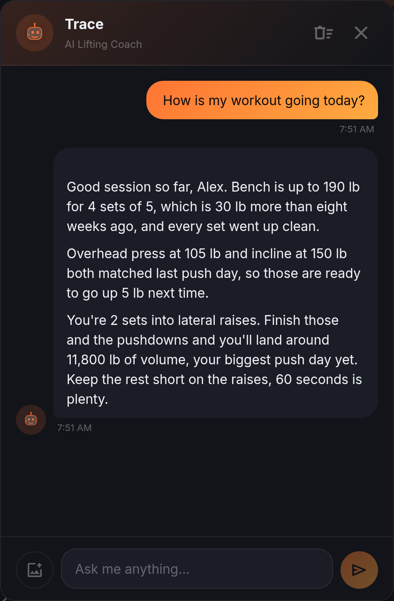

# Trace in LiftTrace and Smart Log



Trace is the LiftTrace AI coach: a floating chat assistant with an animated face, docked bottom-right on every page. Same shared TraceApps persona used in CookTrace and NutriTrace; the tools it can call are the LiftTrace-specific set below. The provider and key setup is identical across the three apps and lives on the shared [Trace setup](../trace/setup.md) page.

## Tools Trace can call

LiftTrace registers 18 tools that Trace can call across a single conversation, spanning read and write across workouts, exercises, programs, PRs, body stats, and coaching. The full catalog with args and returns lives in the [Trace tool catalog](../reference/trace-tools.md); a one-line summary of each follows.

**Read (11)**

- `get_workouts`: recent workouts with completed sets, per-exercise volume, and top set (defaults to last 30 days).
- `get_workout`: one workout in full detail by id, including coach feedback.
- `get_exercises`: search the exercise catalog (wger, free-exercise-db, exercisedb variants, custom).
- `get_exercise`: full detail on one exercise plus similar-exercise suggestions.
- `get_programs`: the user's program library with active flag.
- `get_program`: one program with every template laid out (per-week overrides for multi-week blocks).
- `get_active_program`: the currently active program in full, or `{ active: false }`.
- `get_prs`: personal records with weight, reps, and estimated 1RM per exercise.
- `get_body_stats`: body stats over time (weight, body_fat, any tracked measurement) with change summary.
- `get_stats_overview`: snapshot for a range: workouts done, streaks, weekly volume and frequency, muscle balance, top PRs.
- `get_coach_prescription`: the coach-prescribed workout for a date if the user has a trainer.

**Write (7)**

- `log_workout`: commit a full workout to a specific date.
- `add_exercise_to_diary`: quick-add one exercise to today's diary with no sets yet.
- `log_set`: append a single set to an exercise already in a workout.
- `log_body_stat`: record a body-stat measurement for a date, merging with existing.
- `start_workout_from_template`: load a workout template into a diary day.
- `set_active_program`: switch the user's active program.
- `add_coach_prescription`: coaches only. Prescribe a workout template to a trainee on a target date.

Trace picks tools per turn based on the conversation. Multi-tool turns are common ("check my active program, look at last week's push sessions, prescribe today").

## Context Trace has by default

The system prompt now stays small and stable; live data is fetched via tools on demand. What is always in context:

- **Persona and style**: coach role, concise practical replies, weight unit (`kg` or `lbs`), weekly workout goal.
- **Today's date + day of the week**, so "today" / "yesterday" resolve correctly.
- **User profile**: name / nickname / age / gender when set (drawn from your account and wizard entries), so Trace never hallucinates when asked "what's my name / age".
- **Currently active program name only** (not the full template); Trace calls `get_active_program` if it needs the details.
- **Recent-activity one-liner**: "Trained on 4 of the last 7 days. Last session: 2 days ago (Pull Day)." Enough to know whether the user is in a block or a rest phase without querying.
- **Tool-use guidance**: which tools exist and when to prefer each.

Everything else, full workout history, PR list, body-weight trend, weekly volume and frequency, full program templates, coach prescription details, is fetched via the tools above.

## The hold-to-log gesture

The Trace FAB is draggable and doubles as a voice trigger. Press and hold for **700 ms**:

- FAB turns red.
- The animated face swaps to a mic icon.
- A short beep fires plus (on Android) a haptic tap.
- Voice recording starts using the Web Speech API in the browser or the native recognizer on Android.

Release the FAB to commit; the transcript feeds the **Smart Log parser** (client-side, not a Trace tool) and opens the Smart Add review sheet with your sets ready to confirm. The parser is a deterministic client-side path: cross-multiplied sets (`3x5 @ 225`), RPE targets, rep ranges, AMRAP, bodyweight (`@ BW`), supersets, and short aliases (BB / DB / BP / OHP / DL / SQ / RDL) go straight into structured rows without a tool round-trip. Slide off more than **100 px** from the FAB's center to cancel: the FAB greys, releasing there aborts and nothing is logged. Under the 6-px movement threshold before the 700 ms mark the app treats the gesture as a drag instead, so you can reposition the FAB without arming the mic.

Voice recognition permission is browser-managed on the web and manifest-declared on Android (`RECORD_AUDIO` plus a `RecognitionService` intent query).

## FFT frequency visualizer

While the Radio player is streaming music, Trace's ring turns into a **32-bar SVG frequency visualizer** that reacts in real time to the audio.

- On the web it runs off a `WebAudio` `AnalyserNode` tapped from the shared audio graph.
- On Android it runs off `FftAudioProcessor.java`, an ExoPlayer PCM tap that emits FFT frames to JavaScript through a Capacitor plugin. A separate RAF loop lerps the bars toward the target values so the animation stays smooth even when frames arrive irregularly.

Purely cosmetic; it does not affect playback. If you find it distracting, disable Trace's music-reactive mode from Settings > Integrations > Trace.

## Quick-ask suggestion chips

The chat opens with a row of context-aware chips: recent workouts, current program, PR queries, form checks. Tap one to pre-fill the input and hit send. The chip set rotates so you are not staring at the same six prompts every day.

## Sample prompts

Prompts that exercise the tool set:

```text
Generate today's workout.
How did my push day last Thursday compare to the one before it?
What's my bench PR and when did I hit it?
Log 3x5 @ 225 bench, 3x8 @ 95 OHP, 3x10 dips to today.
Switch me to Push-Pull-Legs.
Start Day A on today's diary.
Weighed in at 82.4 kg this morning.
Is my volume balanced across chest / back / legs this month?
Recommend a deload for next week based on my last block.
```

For form checks, attach a photo (camera or gallery button on the chat input). Multimodal-capable providers (Claude, GPT-4-class OpenAI models, Gemini) will actually look at it.

## Smart Log entry points

Smart Log is the parser that turns natural-language workouts into structured sets. Three ways to get to it:

1. **Smart Add** button in the Diary toolbar. Type or paste.
2. **Sparkle FAB** on the diary (mobile).
3. **Hold-to-record** on the Trace FAB (700 ms hold, described above).

Preview always runs first. Fix names in place, delete rows you did not mean, then commit. Nothing is written to the diary until you confirm. See [Diary and set logging](diary.md#smart-add-and-the-natural-language-parser) for the full syntax.

Smart Log stays separate from the tool catalog on purpose: workout logging is precise and cheap to parse client-side, so a Trace tool round-trip adds latency without adding correctness for the common shapes.

## Provider setup

Trace supports Claude, OpenAI, Gemini, and any OpenAI-compatible endpoint (Ollama, LM Studio, LocalAI, vLLM, DeepSeek, Groq, llama.cpp, Mistral). Setup lives in Settings > Integrations > Trace: pick a provider, enter a key, pick a model, optionally rename the assistant.

Two modes:

- **Per-user key** (default): every user brings their own key. Nothing to set server-side.
- **Server-side proxy**: set `AI_PROVIDER`, `AI_API_KEY`, and (for `oai-compat`) `AI_BASE_URL` and `AI_MODEL` in the server env, and Trace becomes read-only for every user. The server proxies chat requests plus the tool-use loop, so a private-network LLM works without exposing it to the browser.

The Model dropdown includes a **Custom** option on every provider (added in v1.0.1), so you can enter any model ID the vendor supports without waiting for the preset list to catch up.

Retired Gemini `1.5-*` and `2.0-*` model IDs are silently remapped to the current default at request time (v1.0.1), so saved chat history keeps working after Google retires a model.

Full provider setup with per-provider recipes: see [Trace setup](../trace/setup.md) and [Running a local LLM](../trace/local-llm.md).

## Related

- [Trace tool catalog](../reference/trace-tools.md)
- [Trace setup](../trace/setup.md)
- [Running a local LLM](../trace/local-llm.md)
- [Diary and set logging](diary.md)
