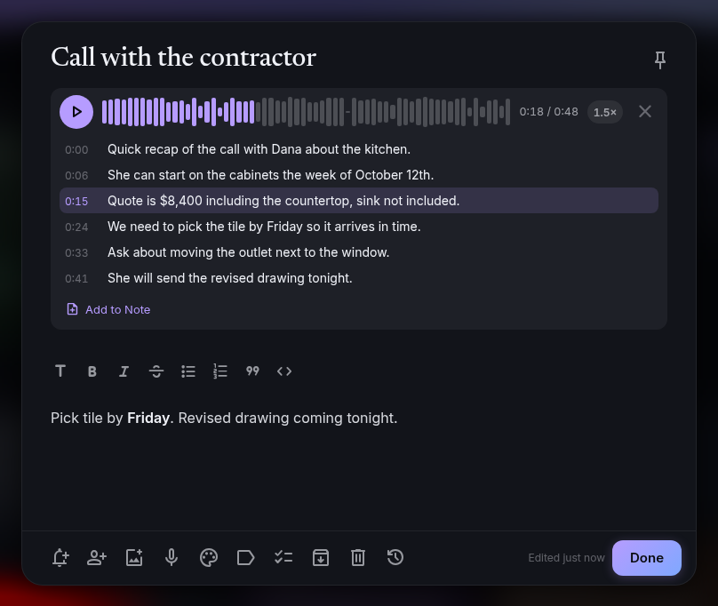

# Feature tour

A guided walkthrough of NoteTrace. Each section anchors so you can deep-link.

## The notes grid {#grid}

Notes open to a card grid. Pinned notes sit in their own section at the top; everything else follows, newest edit first. The grid adds columns as the window grows, from one on a narrow phone to six on an ultrawide, and cards keep their natural height so short notes don't leave gaps.

Each card shows its images across the top, a preview of the first link in the note (the page's title, image, and site, fetched by your server), the title in a band across the card (set in Newsreader, tinted with the note's color), a preview of the body or the first open checklist items, the reminder chip, labels, and a sharing chip when the note is shared. On a desktop, hovering a card shows quick actions (remind, color, archive, trash). On a phone, long-press a card for those plus pin and labels. Tick a checklist item right on the card without opening it.

Type in **Take a note** to start a text note, tap the checkbox icon to start a checklist, the microphone to start a voice note, or the image icon to start a note from photos. On a phone, upright or on its side, Take a note gives way to the round **+** button: tap it for **Text Note**, **List**, **Voice Note**, or **Image**, or hold it to start a voice note straight away. Long-press the app's icon on your home screen for **Voice Note**, **New Note**, and **New List**.

The page header keeps two buttons beside the title: **Search** (the magnifier) and **View Options**. Search and Take a note never share the screen: opening search swaps the header for a search box and tucks Take a note away until you close it.

## The sidebar {#sidebar}

The sidebar holds Notes, Reminders, **Shared with Me** (notes other people share with you), Archive, Trash, your labels, and Settings, with your name and the app version at the bottom. A highlight glides to the page you're on, and Reminders shows how many reminders are due today.

Navigation fits the screen by default (**Settings, Appearance, Navigation Style, Auto**): a phone gets the tab bar and the ☰ menu, an unfolded foldable or small tablet gets a strip of icons beside the page, and a larger screen gets the full sidebar. Pick **Both** to keep the tab bar on a wide screen too.

With **Persistent Sidebar** on, the button beside the logo collapses the sidebar to a slim strip of icons, and the ☰ button at the top of the strip opens it again. Point at an icon to see its name. The choice is remembered on each device. When the sidebar opens from ☰ instead of staying open, it has no collapse button, and phones always use the slide-out menu. Fold the Labels section with the arrow next to its heading. On the Android app connected to a server, the bottom of the sidebar also shows when it last synced.

## Tasks {#tasks}

**Tasks** in the sidebar gathers your to-dos from every checklist into one list. An unchecked item counts as a task when it has a due date, or when its checklist is set to **Show in Tasks** (the circled check in the editor's toolbar, or ⋯ on a phone and in the List layout's note pane). Shopping and packing lists stay out unless you date an item, and the Tasks list itself is always shown. To list every checklist instead, turn on **Settings, Notes, Show Every Checklist in Tasks**.

Group it **By Due Date** (Overdue, Today, Tomorrow, This Week, Later, No Due Date) or **By List**. Under each task is the list it belongs to; tap the name to open that list. The sidebar shows how many tasks are due today or overdue.

### Working with a task {#task-actions}

- **Tick it** with the circle, or swipe it right on a phone. Undo puts it back.
- **Edit it** by tapping its text. Enter saves, Escape leaves it as it was, and clearing the text deletes it.
- **Change the date** with the calendar on the right.
- **The ⋯ menu** (or a right-click) has Edit, Due Date and Repeat, Move to List, Open the List, and Delete. On a phone, swiping left deletes. Delete and Move both have Undo.
- **Drag to reorder**: By List, hold the handle on the left of a task and drag. The order is the list's own, so the note shows it the same way.

A task is still just an item on its checklist: every change here is a change to that note, and it syncs the same way.

### Adding tasks {#adding-tasks}

**Add a task** at the top puts new tasks in a checklist called Tasks, created the first time you use it. The list button beside it picks another list instead, and the calendar sets a due date and repeat as you add. By List, each list also has its own **Add a task** row at the bottom.

Lists already in Tasks come first. Adding or moving an undated task to one of the **Other Lists** also shows that list in Tasks, so the task doesn't vanish from view; the message says so, and **Hide the List** turns it back off.

### Repeating tasks {#repeat}

A task can repeat **Daily**, on **Weekdays**, **Weekly**, **Monthly**, or **Yearly**: open its due date and pick one under Repeat (a task with no date yet starts today). Ticking a repeating task doesn't finish it. It moves to the next time it comes round and a message says when, with Undo. Ticked early, it moves on one step; ticked late, the missed ones are skipped rather than piling up as overdue. The 31st of a month lands on the last day of a shorter month. The date's icon has a small repeat arrow, in Tasks and in the note.

### Completed {#completed}

Tasks ticked in the last week wait in **Completed** at the bottom, folded away. Open it to see them, and tap a circle to untick one.

### Keyboard {#tasks-keyboard}

`j` and `k` move between tasks, `x` ticks, `e` edits, `d` opens the date and repeat, `m` moves to another list, `o` opens the list, `#` deletes, and `n` jumps to Add a task. See [Keyboard shortcuts](shortcuts.md#tasks).

Any checklist item can have a due date: hover an item in the editor (or tap into it on a phone) and pick the calendar. Cards show the date next to the item, in red when it's overdue. Turn on **Tasks Due** in **Settings, Notifications** for one notification a day listing what's due today and overdue.

## List layout {#list}

**View Options** in the header switches between **Grid**, **List**, and **Timeline**. The List layout shows one row per note: the title, two lines of preview, when it was edited with checklist progress and labels, and a thumbnail when the note has an image. It can **group notes** by label, color, or date edited.

When there's room (about 740px beside the sidebar, which includes an unfolded foldable), List becomes a two-pane workspace that fills the window: the list of notes on the left and the open note on the right, each scrolling on its own.

- The list column has the note count and **New Note**; its arrow also offers a new checklist or a note from an image.
- The open note has one toolbar across the top: where the note lives (its first label, like Home › Garage), when it was edited, and pin, reminder, share, image, voice, color, labels, and ⋯ for the rest. Changes save as you type, so there's no Done button; ✕ closes the note.
- Switching to another note saves the one you were on. **Up** and **Down** move through the list and open each note.
- Drag the line between the panes to widen or narrow the list (double-click it to reset). The width is remembered on each device.

On a phone or a narrower window, the rows sit in one column and a row opens the note full screen.

## Foldables {#foldables}

NoteTrace follows a foldable as you fold and unfold it:

- **Each screen keeps its own layout.** Pick Grid on the cover screen and List on the inner screen, and each comes back when you switch.
- **The open note follows you.** Unfold with a note open and it moves beside the list; fold again and it's full screen, with what you typed intact.
- **The cover screen** shows one column of cards when it's narrow, so titles aren't squeezed onto several lines.
- **Half open like a book**, the list fills the left side of the fold and the note the right, and windows such as the editor, dialogs, and the image viewer open on the right side instead of across the crease.
- **Half open on a table**, the note stays above the fold while its toolbar and the keyboard sit below; the image viewer shows the photo above the fold and its details below.

The fold's position comes from Android in the app. In the installed web app, it works where the browser reports the fold (Chrome on Android); elsewhere the size-based changes still apply. See [Android](android.md#foldables).

## Organize many notes at once {#select}

Deleting a checklist item, removing an image or a voice note, and switching a note between text and checklist can all be taken back with **Undo** in the message that appears.

Select notes with **Ctrl+click** (**Cmd+click** on a Mac), the round check that appears on a card's corner when you hover, or a **long press** on a phone. Once one is selected, a click or tap adds more, and **Shift+click** selects a range. A bar at the bottom pins, sets a reminder, colors, labels, archives, or trashes them all at once. In the Trash it restores or deletes them forever. Press **Esc** or the ✕ to clear the selection.

## Your own order {#order}

Drag a note to move it: press and drag with a mouse, or long-press and drag on a phone. The first drag switches Notes to **Your Order**, which follows you to every device; new notes still land at the top. Switch back to newest edit first in **Settings, Appearance, Note Order**.

On a phone, swipe a card sideways to archive it (in Archive, a swipe brings it back), with **Undo** for a few seconds. Pull down at the top of the list to refresh. Turn swiping off in **Settings, Appearance, Swipe to Archive**.

## Write and edit {#editor}

The editor saves as you type; there is no Save button. A brand-new note is only created once it has something in it, and a note you empty out is removed instead of leaving a blank card behind.

Text notes use a rich editor with bold, italic, strikethrough, headings, lists, quotes, and code. What's saved is plain Markdown, so the same note reads correctly in an export or any other Markdown app. Type **/** for slash commands (headings, lists, a checklist, an image, a reminder, and more), and press **?** in the notes list for keyboard shortcuts. See [Keyboard shortcuts and slash commands](shortcuts.md).

A note opens by growing out of its card, and shrinks back into it when you close it.

Checklists have one row per item. Press Enter for the next item, drag the handle to reorder, and checked items collapse into a **checked items** group under the list. **Show Checkboxes** and **Hide Checkboxes** switch a note between text and checklist: each line becomes an item, and checked items come back as struck-through lines.

The bar along the bottom holds reminder, Ask Trace, Send to CookTrace, share, add image, record voice note, color, labels, text/checklist, archive, trash, and version history. Buttons only appear where they apply: Ask Trace on text notes once Trace is set up, Send to CookTrace on checklists once CookTrace is linked. On a phone the bar stays above the keyboard while you type and keeps a short row: **Add** (image, voice note, checkboxes), **Formatting** (swaps the bar to bold, headings, lists, and the rest), color, reminder, and **More Options** for labels, sharing, Trace, CookTrace, archive, version history, and trash.

## Images {#images}

Add images with the image button, by pasting an image, or by dragging image files onto the editor. They sit above the text or checklist: one image fills the width, more form a grid. Tap one to see it full screen, and swipe or use the arrow keys to move between them. Large photos are scaled down before upload (longest side 2400px). Images sync to every device and come along when a note is shared.

## Drawings {#drawings}

Sketch, handwrite, or whiteboard straight into a note, the way Google Keep does.

- **Start one** with the brush on the **Take a note** bar or **Drawing** in a phone's **+** menu (a new note that opens on a blank sheet), or add one to any note with the brush in the editor's toolbar, **Drawing** in a phone's **Add** sheet, or `/drawing`.
- **Tools**: **Pen**, **Marker**, and **Highlighter**, each with its own colour and three sizes; an **Eraser** that removes whole strokes it touches; and **Select**, a lasso that picks up strokes to move or **Delete**. A stylus draws thinner and thicker with pressure.
- **The sheet**: **Paper** or **Dark**, plain or with **Dots**, **Squares**, or **Lines**. It grows downward as you draw near the bottom, and **Clear the Drawing** starts over.
- **Getting around**: two fingers pan and zoom on a touch screen. With a stylus, fingers never draw, so your palm can rest on the screen, and one finger pans. With a mouse, the wheel scrolls, **Ctrl** or **Cmd** with the wheel zooms, and the middle button or **Space** and drag pans. The zoom button returns to the full width.
- **Undo** and **Redo** cover every stroke, erase, move, and sheet change.

**Done** (or the back arrow, or Android's back gesture) saves the drawing as a picture on the note, with a small brush on it. It shows on the card like any image, and tapping it in the editor opens it again with every stroke still editable. A drawing cleared of every stroke leaves the note, with Undo. With **Read Text in New Images** on, Trace reads handwriting in a drawing into search as well. Tools, colours, sizes, and the sheet you last used are remembered on each device.

## Files {#files}

A note can carry any kind of file, the way Apple Notes and Evernote do: a PDF quote, a lease, a spreadsheet, a zip of photos, a video clip.

- **Add one** with the paperclip in the editor's toolbar (**Attach File** in a phone's **Add** sheet), by typing `/file`, or by dropping or pasting files onto the note. On Android and in the installed web app, sharing a file to NoteTrace from another app attaches it to a new note.
- **Each file shows as a chip** with its name, what kind of file it is, and its size. A PDF's chip shows a picture of its first page.
- **Tap a chip to open it.** PDFs open page by page, text files (`.txt`, Markdown, CSV, JSON) show as text, and videos play. Anything else says what it is and offers **Download** (in the Android app, **Open With** hands it to another app). The arrow keys and side buttons move between a note's files.
- **Search reads inside them.** The words in a PDF or a text file are read when it's added, so searching for something in the document finds the note, with a line showing where it matched.
- **Cards** show the first two files by name with a count of the rest, and the **Files** chip under search finds notes that have any.

Remove a file with the ✕ on its chip; Undo puts it back. Files sync to your other devices, come along when a note is shared, and are included in backups. The largest file a server accepts is 100 MB unless the admin changes it (`UPLOAD_MAX_MB`).

## Links and the timeline {#links}

Type `[[` in a text note to link to another note; NoteTrace suggests titles as you type. Tap a link to open that note, and see which notes link to the one you're reading under **Linked From**. Rename a note and your links follow. See [Links between notes](notes.md#links).

**Timeline** in **View Options** switches the grid to a timeline, grouped by the day you last edited each note. See [Timeline view](notes.md#timeline).

## Voice notes and text in images {#voice}

Start a voice note from the microphone on Take a note (or **+**, then **Voice Note**, on a phone), or add one to any note from the editor. Pause and resume while you record; the Android app keeps recording with the screen off, for up to 3 hours. Drag along the waveform to find a spot, change the play speed, and pick up where you left off. Audio files, recordings shared from other apps, and Google Keep's voice recordings become voice notes too. Trace transcribes each one so you can read it, search for it, and tap a line of the transcript to hear that part. See [Voice notes](voice-notes.md).

 Open an image full screen and tap **Read Text** to pull the text out of a receipt, whiteboard, or screenshot, and search finds the note by it. See [Trace in NoteTrace](trace.md#voice).

## Trace {#trace}

**Ask Trace** in the editor tidies up a note, summarizes it, or turns it into a checklist, and shows you the result before anything changes. In the Trace chat, ask about your notes or have Trace create lists, add and check items, set reminders, and apply labels. See [Trace in NoteTrace](trace.md).

## Labels, colors, archive, trash {#organize}

Labels live in the sidebar with their note counts. Name a label with a slash, like `Home/Garage`, to nest it under `Home`; the parent can be a label itself or just a group, a parent's view includes its nested labels' notes, and renaming a parent renames everything under it. Pick one to see only its notes, or use **Edit Labels** to rename, recolor, reorder, or delete them. Notes can carry several labels.

Sixteen note colors tint the card and editor, each with a matching light-theme version. Labels use the same colors for their dot or icon.

Archive hides a note from the grid without deleting it. Trash keeps notes for 30 days, then deletes them for good; restore or delete one early from the Trash view, or empty the whole trash at once.

## A big library {#performance}

Notes are drawn a screenful at a time and more appear as you scroll, so thousands of notes open as quickly as a handful. Searching, **Select All**, and the keyboard keys still cover every note, not just the ones on screen.

## Offline {#offline}

The web app keeps working when the connection drops, in a browser tab or installed as an app. It opens without a connection and shows the notes, images, and voice notes it has already seen, and you can keep editing:

- **What works offline**: writing and editing notes and lists (titles, text, items, ticking, reordering, due dates), new notes and lists, colours, pins, labels on a note, reminders, archive, trash and restore, and search over the notes this browser has seen. Tasks and the Tasks Due badge follow along.
- **What waits for the connection**: pictures, files, drawings, and voice notes being added (a recorded voice note is kept and uploads later), version history, sharing, creating or renaming labels, imports, and Trace. These say they need a connection.

A small bar at the top says **Offline** and how many edits are waiting. Edits are kept in the browser, so they survive closing the tab or a reload. When the connection is back they go to the server on their own (tap the bar to send them sooner) and it says **Edits synced**.

They sync the same way the Android app does. If a note was also changed somewhere else while you were offline, the newer change wins and the other one is kept in [version history](#history), so nothing is lost. Checklist items merge one by one, so ticking an item offline and adding one on your phone both stick.

Signing out clears this browser's offline copy. If edits are still waiting, NoteTrace tries to send them first and asks before signing out without them. The Android app has its own offline story: see [Local vs server-connected mode](../mobile/modes.md).

A voice note whose upload fails isn't lost: it's kept on the device, shows as **waiting to upload** on its note, and goes up when the connection is back (or when you press **Retry**).

## Search {#search}

Tap the magnifier in the header (or press `/`) to search. The header turns into a search box that says what you're searching (Search Notes, Search Archive, or a label), and chips appear under it to narrow the list by type (Lists, Text, Images, Voice, Files, Reminders, Shared, Links), by color, and by label. Pick more than one in a group to match any of them; picks in different groups must all match. **Clear Filters** removes them, and the ✕ or **Esc** closes search and clears both the text and the chips. Matching words are marked on the cards, and a note found by a word inside a voice note, an image, or a file shows that line with a microphone, image, or file icon. Your recent searches appear under an empty search box, ready to run again. The search box searches titles, note bodies, checklist items, voice note transcripts, text read from images, and the text inside PDFs and text files together within the view you're in (Notes, Archive, Trash, or a label), and matches word beginnings as you type, so `jelly` finds "Jellyfin". Press **Ctrl+K** (**Cmd+K** on a Mac) from anywhere to jump to it.

## Print or save as PDF {#print}

**Print or Save as PDF** in a note's **⋮** menu (or **Ctrl+P**, **Cmd+P** on a Mac, while the note is open) lays the note out as a clean page: the title, its labels and when it was last edited, the text with its headings, lists, and links, or the list with checked items struck through and due dates beside them, then the note's pictures and drawings, voice note summaries and transcripts, and the names of attached files. Your browser's or Android's print dialog opens with it, and choosing **Save as PDF** there makes a PDF. The page always prints on white, whatever the note's colour or your theme.

## Templates {#templates}

A template is a note to start from, like a meeting agenda, a packing list, or a weekly review.

- **Save one**: open a note and choose **Save as Template** in its **⋮** menu, then name it. The template keeps the note's title, text or list items, and colour; pictures, files, labels, and reminders stay with the note, and checked items come back unchecked.
- **Use one**: **New from Template** on the **Take a note** bar, or **Template** at the top of a phone's **+** menu. With one template it opens straight away; with more, pick from the list. The new note is an ordinary note, so changing it never changes the template.
- **Fill-ins**: `{date}`, `{time}`, and `{weekday}` in a template's title, text, or items become today's date (in your Date Format), the time, and the day of the week, so "Standup {date}" starts as "Standup Sep 16, 2026".
- **Manage them** in **Settings › Notes › Templates**: rename, or delete with Undo. To change what a template holds, make a note from it, edit that, and save it as a template again.

Templates sync with your account setting, so every device has them, and they never show up among your notes, in search, Tasks, or reminders. You can keep up to 50.

## Version history {#history}

Open **Version History** from a note's **⋮** menu to see earlier versions of a note and restore one. A new restore point is saved at the start of each editing session (not every keystroke), before a restore or a text/checklist switch, and whenever sync resolves a conflict between two devices, so the losing edit is always recoverable. The last 50 versions of each note are kept.

## Reminders {#reminders}

Tap the bell on a note for **Later today**, **Tomorrow**, **Next week**, or a date and time of your choice, with an optional repeat. The Reminders view lists upcoming reminders soonest first, with past ones underneath. Reminders arrive as exact alarms on Android, as notifications in an open browser tab, and through your push service. See [Reminders](reminders.md).

## Sharing {#sharing}

Share a note or checklist with other accounts on your NoteTrace server and choose **Can edit** or **Can view**. See [Sharing](sharing.md).

## Android {#android}

The Android app works fully offline in local mode, or syncs with your server. Share text, links, photos, or audio from any app into a new note (the installed web app accepts them too), start a note, list, voice note, or drawing from a home screen widget, shortcut, or Quick Settings tile, see pinned and recent notes in a Notes widget, record voice notes with the screen off, get reminders as notifications with **Done** and **Snooze** buttons, and optionally lock the app behind your fingerprint, face, or PIN. See [Android: share sheet, voice notes, and App Lock](android.md).

## CookTrace {#cooktrace}

Link your CookTrace server in Settings and send a checklist's open items to your CookTrace shopping list in one tap. See [Send to CookTrace](cooktrace.md).

## Accessibility {#accessibility}

NoteTrace is checked against WCAG 2.1 AA with axe-core on its main screens, dialogs, and menus, in dark and light themes and at phone size.

- **Keyboard**: everything opens and works from the keyboard. Dialogs, sheets, menus, and viewers take focus when they open, keep **Tab** inside them, close with **Esc** (only the top one), and hand focus back to where you were. Notes open with **Enter** or **Space**, and the [keyboard shortcuts](shortcuts.md) cover the rest.
- **Screen readers**: buttons, fields, switches, lists, the note text, and every popup have names; pages have a main landmark and headings; the offline and sync status is announced.
- **Reading**: secondary text meets 4.5:1 contrast in both themes, and the web app can be zoomed.
- **Motion**: **Reduce Motion** in Settings, or the system's reduced-motion setting, turns animations off.

## Import and export {#import}

Bring notes in from Google Keep (Takeout), Evernote, Memos, Blinko, or Markdown files, images included, and export every note as a Markdown ZIP. See [Import and export](import-export.md).
