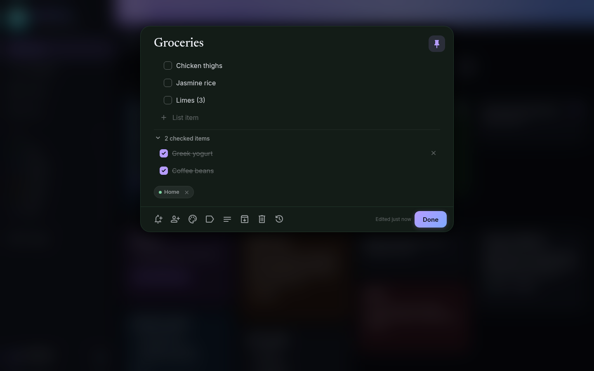
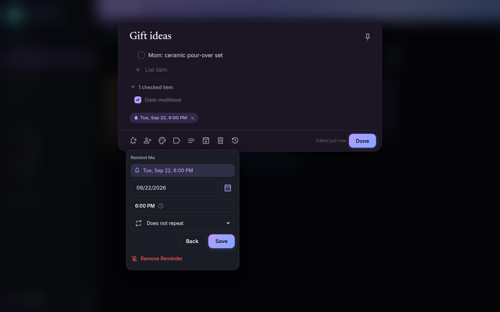
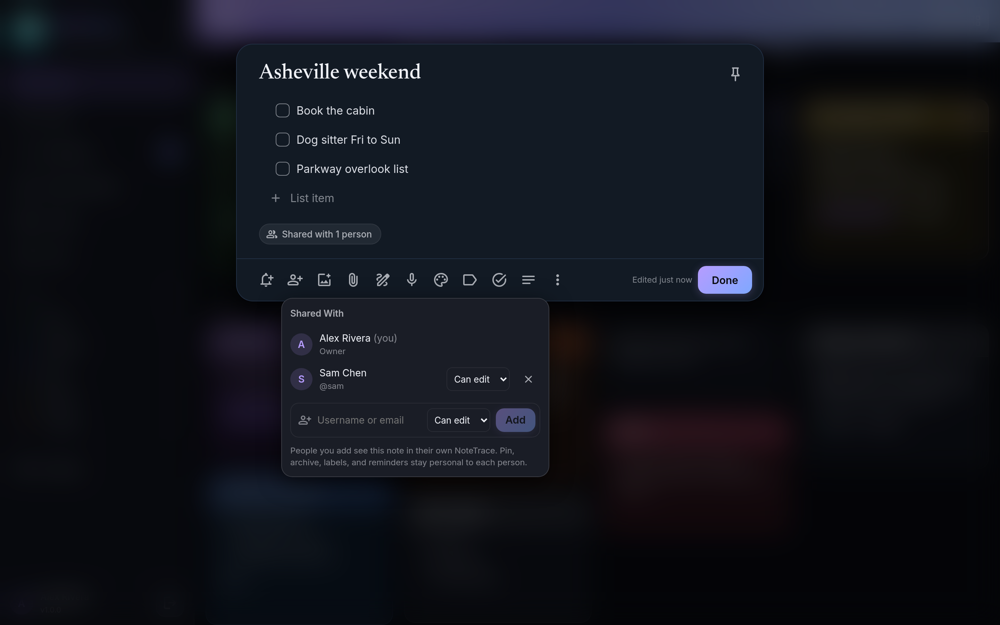
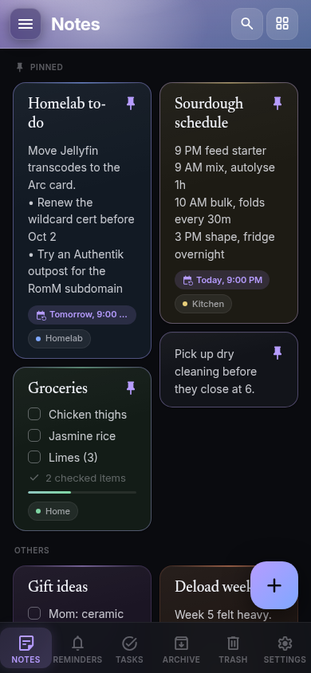
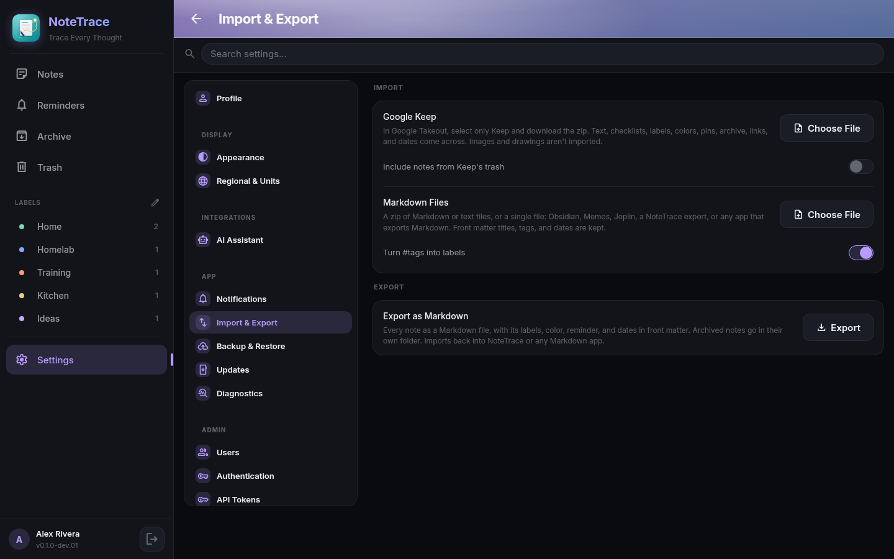

# Feature tour

A guided walkthrough of NoteTrace. Each section anchors so you can deep-link.

## The notes grid {#grid}

Notes open to a card grid. Pinned notes sit in their own section at the top; everything else follows, newest edit first. The grid adds columns as the window grows, from one on a narrow phone to six on an ultrawide, and cards keep their natural height so short notes don't leave gaps.

Each card shows its images across the top, a preview of the first link in the note (the page's title, image, and site, fetched by your server), the title (set in Newsreader), a preview of the body or the first open checklist items, the reminder chip, labels, and a sharing chip when the note is shared. On a desktop, hovering a card shows quick actions (remind, color, archive, trash). On a phone, long-press a card for those plus pin and labels. Tick a checklist item right on the card without opening it.

Type in **Take a note** to start a text note, or tap the checkbox icon to start a checklist. On a phone the round **+** button does the same.

## The sidebar {#sidebar}

The sidebar holds Notes, Reminders, **Shared with Me** (notes other people share with you), Archive, Trash, your labels, and Settings, with your name and the app version at the bottom. A highlight glides to the page you're on, and Reminders shows how many reminders are due today.

On a wide screen, the button next to the logo collapses the sidebar to icons for more room (or use **Settings, Appearance, Collapse Sidebar to Icons**). Fold the Labels section with the arrow next to its heading. On the Android app connected to a server, the bottom of the sidebar also shows when it last synced.

## Organize many notes at once {#select}

Select notes with **Ctrl+click** (**Cmd+click** on a Mac), the round check that appears on a card's corner when you hover, or a **long press** on a phone. Once one is selected, a click or tap adds more, and **Shift+click** selects a range. A bar at the bottom pins, sets a reminder, colors, labels, archives, or trashes them all at once. In the Trash it restores or deletes them forever. Press **Esc** or the ✕ to clear the selection.

## Your own order {#order}

Drag a note to move it: press and drag with a mouse, or long-press and drag on a phone. The first drag switches Notes to **Your Order**, which follows you to every device; new notes still land at the top. Switch back to newest edit first in **Settings, Appearance, Note Order**.

On a phone, swipe a card sideways to archive it (in Archive, a swipe brings it back), with **Undo** for a few seconds. Pull down at the top of the list to refresh. Turn swiping off in **Settings, Appearance, Swipe to Archive**.

## Write and edit {#editor}

The editor saves as you type; there is no Save button. A brand-new note is only created once it has something in it, and a note you empty out is removed instead of leaving a blank card behind.

Text notes use a rich editor with bold, italic, strikethrough, headings, lists, quotes, and code. What's saved is plain Markdown, so the same note reads correctly in an export or any other Markdown app. Type **/** for slash commands (headings, lists, a checklist, an image, a reminder, and more), and press **?** in the notes list for keyboard shortcuts. See [Keyboard shortcuts and slash commands](shortcuts.md).

A note opens by growing out of its card, and shrinks back into it when you close it.

Checklists have one row per item. Press Enter for the next item, drag the handle to reorder, and checked items collapse into a **checked items** group under the list. **Show Checkboxes** and **Hide Checkboxes** switch a note between text and checklist: each line becomes an item, and checked items come back as struck-through lines.

The bar along the bottom holds reminder, Ask Trace, Send to CookTrace, share, add image, record voice note, color, labels, text/checklist, archive, trash, and version history. Buttons only appear where they apply: Ask Trace on text notes once Trace is set up, Send to CookTrace on checklists once CookTrace is linked. On a phone the bar stays above the keyboard while you type and keeps a short row: **Add** (image, voice note, checkboxes), **Formatting** (swaps the bar to bold, headings, lists, and the rest), color, reminder, and **More Options** for labels, sharing, Trace, CookTrace, archive, version history, and trash.

## Images {#images}

Add images with the image button, by pasting an image, or by dragging image files onto the editor. They sit above the text or checklist: one image fills the width, more form a grid. Tap one to see it full screen, and swipe or use the arrow keys to move between them. Large photos are scaled down before upload (longest side 2400px). Images sync to every device and come along when a note is shared.

## Links and the timeline {#links}

Type `[[` in a text note to link to another note; NoteTrace suggests titles as you type. Tap a link to open that note, and see which notes link to the one you're reading under **Linked From**. Rename a note and your links follow. See [Links between notes](notes.md#links).

The **Timeline View** button beside the search box switches the grid to a timeline, grouped by the day you last edited each note. See [Timeline view](notes.md#timeline).

## Voice notes and text in images {#voice}

Tap the microphone in the editor to record a voice note. Trace transcribes it so you can read it at a glance, search for it, and add it to the note. Open an image full screen and tap **Read Text** to pull the text out of a receipt, whiteboard, or screenshot, and search finds the note by it. See [Trace in NoteTrace](trace.md#voice).

## Trace {#trace}

**Ask Trace** in the editor tidies up a note, summarizes it, or turns it into a checklist, and shows you the result before anything changes. In the Trace chat, ask about your notes or have Trace create lists, add and check items, set reminders, and apply labels. See [Trace in NoteTrace](trace.md).

## Labels, colors, archive, trash {#organize}

Labels live in the sidebar with their note counts. Name a label with a slash, like `Home/Garage`, to nest it under `Home`; the parent can be a label itself or just a group, a parent's view includes its nested labels' notes, and renaming a parent renames everything under it. Pick one to see only its notes, or use **Edit Labels** to rename, recolor, reorder, or delete them. Notes can carry several labels.

Six note colors (plum, tide, moss, sand, clay, rose) tint the card and editor, with matching light-theme versions.

Archive hides a note from the grid without deleting it. Trash keeps notes for 30 days, then deletes them for good; restore or delete one early from the Trash view, or empty the whole trash at once.

## Search {#search}

When you click into search, chips appear under it to narrow the list by type (Lists, Text, Images, Voice, Reminders, Shared, Links), by color, and by label. Pick more than one in a group to match any of them; picks in different groups must all match. **Clear Filters** removes them. The search box searches titles, note bodies, checklist items, voice note transcripts, and text read from images together within the view you're in (Notes, Archive, Trash, or a label), and matches word beginnings as you type, so `jelly` finds "Jellyfin". Press **Ctrl+K** (**Cmd+K** on a Mac) from anywhere to jump to it.

## Version history {#history}

Open **Version History** in the editor to see earlier versions of a note and restore one. A new restore point is saved at the start of each editing session (not every keystroke), before a restore or a text/checklist switch, and whenever sync resolves a conflict between two devices, so the losing edit is always recoverable. The last 50 versions of each note are kept.

## Reminders {#reminders}

Tap the bell on a note for **Later today**, **Tomorrow**, **Next week**, or a date and time of your choice, with an optional repeat. The Reminders view lists upcoming reminders soonest first, with past ones underneath. Reminders arrive as exact alarms on Android, as notifications in an open browser tab, and through your push service. See [Reminders](reminders.md).

## Sharing {#sharing}

Share a note or checklist with other accounts on your NoteTrace server and choose **Can edit** or **Can view**. See [Sharing](sharing.md).

## Android {#android}

The Android app works fully offline in local mode, or syncs with your server. Share text, links, or photos from any app into a new note (the installed web app accepts shared photos too), get reminders as notifications with **Done** and **Snooze** buttons, and optionally lock the app behind your fingerprint, face, or PIN. See [Android: share sheet and App Lock](android.md).

## CookTrace {#cooktrace}

Link your CookTrace server in Settings and send a checklist's open items to your CookTrace shopping list in one tap. See [Send to CookTrace](cooktrace.md).

## Import and export {#import}

Bring notes in from Google Keep (Takeout), Evernote, Memos, Blinko, or Markdown files, images included, and export every note as a Markdown ZIP. See [Import and export](import-export.md).
