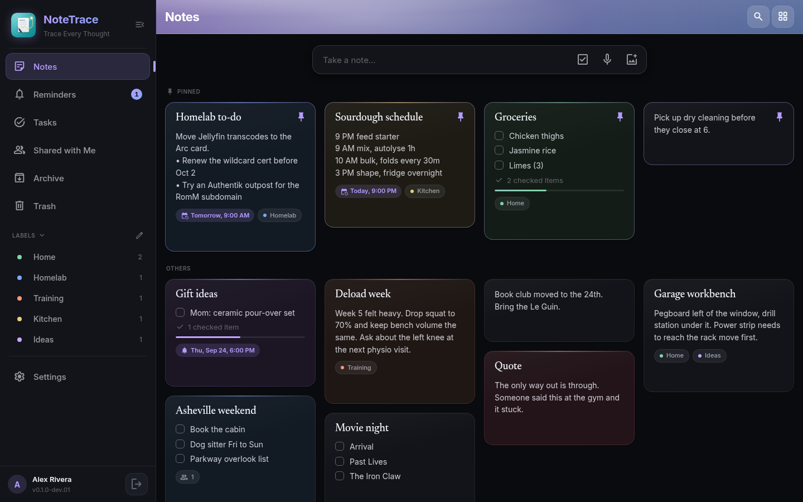

# NoteTrace

NoteTrace is a self-hosted alternative to Google Keep: notes, checklists, and reminders in a clean card grid, in a single Docker container on your own hardware. One Node/Express server, one Svelte PWA, a SQLite database, and a Capacitor Android app that either runs fully offline or syncs against the same server. AGPL-3.0, no telemetry, nothing leaves your network unless you point it at a push service or AI provider yourself.

The idea is Keep's speed with the pieces Keep leaves out: open it and start typing, and when you need more there is Markdown formatting, version history, repeating reminders that keep their local time, sharing with other people on your server, and a one-click move out of Google Keep.

!!! note "In development"
    NoteTrace is the newest Trace app and is working toward its first release candidate. Docker images and signed APKs are published when that release candidate is out. Until then, these pages describe the app as it stands on the `dev` branch.

## Compared to other note apps

NoteTrace isn't trying to be a knowledge base. It's for the notes you'd put in Keep.

- **Google Keep** is quick and simple, and it's Google's. NoteTrace keeps the card grid, checklists, colors, labels, pins, archive, and reminders, runs on your own server, and imports your Keep notes, photos included, straight from Google Takeout.
- **Memos** and **Blinko** are timeline-first and lean on tags and AI. NoteTrace is grid-first with real checklists and reminders, and imports straight from both.
- **Evernote** grew into a heavyweight workspace. NoteTrace keeps the everyday part (quick notes, checklists, clipped links, reminders) and imports your `.enex` exports with their images and tags.
- **Obsidian**, **Joplin**, and **Trilium** are built for long-form, linked documents. NoteTrace stores Markdown too, so notes stay portable, but it's tuned for short notes and lists you check every day.

## What's inside

- Card grid with a pinned section, quick capture, and a layout that fills wide screens (1 to 6 columns).
- Rich editor that saves Markdown, and checklists with drag to reorder. Switch any note between text and checklist without losing content.
- Images on any note: add, paste, drag in, or share them from your phone's gallery.
- Labels with colors, six note colors, archive, and a trash that empties itself after 30 days.
- Full-text search across titles, bodies, and checklist items, one Ctrl+K away.
- Version history: every editing session leaves a restore point, and sync conflicts never throw an edit away.
- Reminders, one-off or repeating (daily, weekly, monthly, yearly): exact alarms on the phone, notifications in the browser, and pushes through ntfy, Gotify, or Apprise.
- Sharing with view or edit access for other accounts on your server.
- Import from Google Keep (Takeout, photos included), Evernote, Memos, Blinko, and Markdown; export everything as Markdown with images.
- Android app with share-sheet capture for text, links, and photos, an optional fingerprint or face app lock, and full offline mode.
- The shared Trace foundation: OIDC SSO, backups, in-app updates, Trace AI, API tokens, webhooks.

## Get started

- [Install with Docker Compose](../getting-started/compose.md) has a NoteTrace tab.
- [Feature tour](features.md) walks through the app before you install.
- [Import and export](import-export.md) covers moving your notes in from Google Keep, Evernote, and others.

## Shared setup pages

Authentication, Trace AI, backups, push notifications, reverse proxies, and the Android sync model work the same way in NoteTrace as in the other Trace apps, so those pages apply here too. Where NoteTrace differs, its own pages say so.

## Related

- [Mobile install](../mobile/install.md)
- [Push notifications overview](../integrations/notifications.md)
- [How the apps compare](../self-hosting/compare.md)
