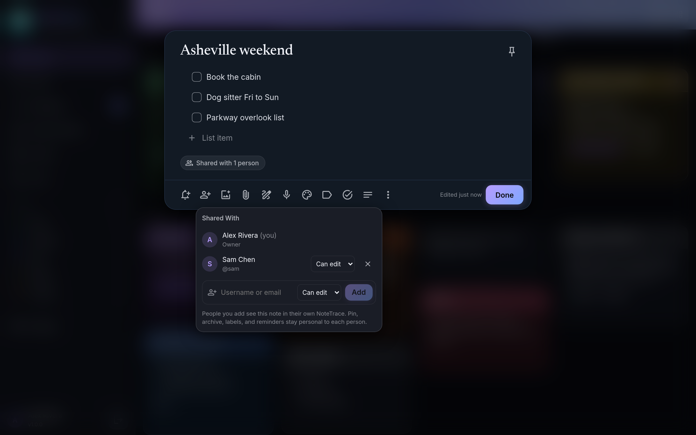

# Sharing

Share a note or checklist with other accounts on the same NoteTrace server: a grocery list with your household, a trip plan with a friend. Sharing needs user accounts, so it isn't available in single-user setups or Android local mode.

## Share a note

1. Open the note and tap the **Share** button (person with a plus) in the bottom bar.
2. Type a username or email address. Names of other accounts on the server are suggested as you type.
3. Pick **Can edit** or **Can view** and tap **Add**.

The note appears in the other person's NoteTrace right away, and on their phone after its next sync. Change someone's access or remove them from the same dialog. The card and editor show **Shared with N people** so you can tell a shared note at a glance.

## What's shared and what's personal

| | Owner | Can edit | Can view |
|---|---|---|---|
| Title, body, color, checklist items, images | Edit | Edit | Read |
| Check off items | Yes | Yes | No |
| Version history | Browse and restore | Browse and restore | Browse |
| Pin and archive | Their own | Their own | Their own |
| Labels | Their own | Their own | Their own |
| Reminder | Yes | No | No |
| Trash and delete forever | Yes | No | No |
| Add or remove people | Yes | No | No |
| Leave the note | n/a | Yes | Yes |

Pinning or archiving a shared note only changes it for you. Labels you add to a shared note are only visible to you, and your label counts only include notes you can see.

## Leaving and losing access

A member can open the share dialog and choose **Leave Note**. The note disappears from their notes and devices; the owner can share it again later.

If the owner removes someone, moves the note to the trash, or deletes it, the note disappears from that person's notes and from their phone on its next sync. Restoring it from the trash brings it back for everyone it's shared with.

## Public link

For someone without an account, the owner can make a public link: open **Share**, then **Create Link** under **Public Link**. The link is copied for you, with **Copy**, **Open Link**, and, on phones, **Send Link** (the share sheet) beside it.

- Anyone with the link can read the note: its title, its text or checklist, and its pictures, voice notes, and files. They can't change anything or tick items off.
- The page shows nothing about you or who else the note is shared with: no name, labels, reminders, or version history.
- It always shows the note as it is now, so later edits reach whoever has the link.
- Chat apps and social sites show a preview: the title, a line of the text, and the first picture.
- Search engines are asked to skip it, and following a link inside the note doesn't pass its address on.
- **Remove Link** stops it working at once. A new link gets a different address, and the old one never comes back.
- While the note is in the trash its link reads nothing; restoring the note brings the same link back.

Only the owner can make or remove the link, and like the rest of sharing it needs a server with user accounts.

## Editing at the same time

Shared notes follow the same rules as editing one note from two devices. Checklist items merge per item, so two people adding and checking items at once both keep their changes. For the title and body, the later edit wins and the other one is saved in [version history](notes.md#version-history) rather than lost.

## Related

- [Local users, invites, roles](../auth/local-users.md) for adding accounts to share with
- [How sync works](../mobile/sync.md)
