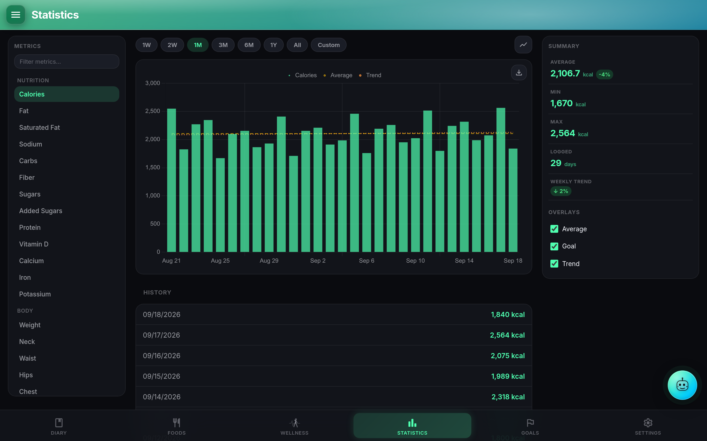
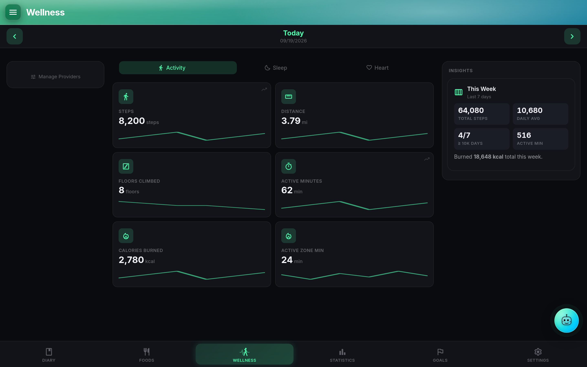
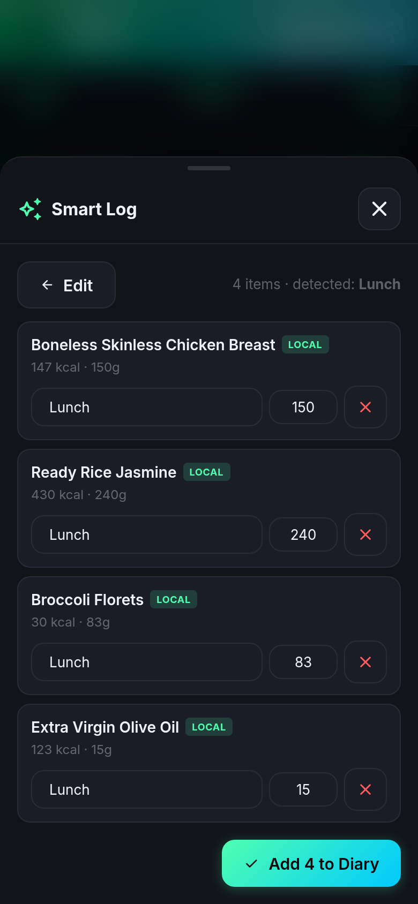

# Feature tour

A walkthrough of the flows most users actually do every day. Each section jumps to the deep-dive page for that area.

## Log today's meals

Open the **Diary** (the default landing page). The date sits at the top with prev/next arrows and a jump-to-today button. Below it, one card per meal slot: Breakfast, Lunch, Dinner, Snacks by default, or whatever custom names you set in Settings.

Tap **+ Add** on any meal to open the picker. The picker lists your Foods, Meals, and Recipes with a search box, favorites at the top (if you have that sort enabled), and source filter chips: Local / OFF (Open Food Facts) / USDA / Mealie / From Others. Long-press a chip to combine sources (multi-source view). Type a partial name and fuzzy search will match with edit distance 1 for words of four or more characters.

Pick a food. The quantity sheet opens with a live nutrition preview: calories, protein, carbs, and fat update as you change the amount, the unit, or the number of servings. Any food note ("1 serving = 150 g cooked", for example) surfaces here. Confirm, and the item lands in the meal.

Long-press an item (mobile) or right-click (desktop) for edit / move / copy / delete. Per-meal, the `⋮` menu covers meal-level actions: copy or move every item to another meal, copy the meal to another date, save the meal to your library, or clear it. **Split Recipe** takes a logged recipe and breaks it into its component ingredients in place; each child stays individually editable and the totals stay correct.

Full detail: [Diary & meal logging](diary.md).

## Check the macro bar

The macro summary lives at the top of the Diary page. It shows your day's calorie total, your remaining calories, and a ring or bar per macro (protein / carbs / fat). Modes are `consumed` or `remaining`; the legend mode is configurable. Tap the ring to open the Nutrition Summary sheet with every tracked nutrient laid out, plus the per-meal breakdown. Custom nutrients defined in Settings show up here too.

## Review the week's stats

Switch to **Statistics**. Pick a nutrient, body stat, workout metric, wellness metric, or IF stat from the chip row. The chart underneath renders as bar or line (configurable), with optional overlays for the goal, the trailing average, and a trend line. Date range is a picker at the top; the chart supports zero-baseline toggle, include-today toggle, and show-empty-days toggle.

The chip row is drag-reorderable, and any chip you hide via long-press stays hidden until you show it again. Chart.js is loaded as a separate async chunk so the page stays responsive even with a lot of series.

## Hit Wellness for wearable-informed suggestions

Open **Wellness**. If you have any wearable connected (Fitbit via Google Health, Withings, Garmin, or Health Connect on Android), the top of the page is a tile grid: last night's Sleep Score with sub-metrics (Sound Sleep, Restlessness, Time to Sound Sleep, Interruptions), today's Readiness, this week's Resilience bucket (Optimal / Balanced / Low), HRV, resting HR, steps, SpO₂, and workouts. Each tile has a sparkline for context.

Above the tiles, per-provider connection banners surface state (green / yellow / red), the last-sync timestamp, and a "Sync now" button. Yellow means authorized but the last sync errored, and the actual error text shows underneath so you can act on it. Re-auth, force-sync, and disconnect all live in the same banner.

Full detail: [Wellness & wearables](wellness.md). Migrating from the legacy Fitbit API is a separate walkthrough at [Fitbit → Google Health migration](google-health.md).

## Set an Adaptive TDEE goal

Open **Settings → Goals**. Under **Calorie Goal Mode**, pick one of three:

- **Fixed**: you type a target. Simple, unchanging.
- **Dynamic**: yesterday's wearable-measured calories out, multiplied by a Lose (−20%), Maintain, or Gain (+20%) factor. Needs a wearable that reports calories_out.
- **Adaptive**: a learned TDEE from your last 35 days of intake and weight, using the standard `1 kg ≈ 7,700 kcal` energy balance. Needs at least 21 days of both signals; falls back to Fixed until then.

If you pick Adaptive, the Goals page shows a readiness card with a progress bar so you can see how close you are to the 21-day minimum. Once ready, the same card shows the learned TDEE and a confidence percentage; a low confidence value means treat the number as an approximation.

Full detail: [Goals & Adaptive TDEE](goals.md).

## Log with your voice (Smart Log)

Press-and-hold the **Trace** FAB on the Diary. Say what you ate ("large latte and a bagel with cream cheese for breakfast"). The on-device speech recognizer (Android system STT or the Web Speech API) transcribes; only the transcript reaches the LLM. Trace matches your saved foods, meals, recipes, yesterday's diary rows, and water, splits the entry into meal slots by keyword, and adds the items to the right meals.

Same FAB, tap instead of press-and-hold, for a text chat. The Scan Label button in the Foods Nutrition card sends a photo of a nutrition label to your configured AI provider and fills every field in one tap.

Full detail: [Trace in NutriTrace + Smart Log](trace.md).

## Add a body stat

Body stats live in a collapsible section on the Diary. Configurable fields (weight, waist, chest, custom entries, and more) reorder via drag; hidden fields sit in the picker until you re-add them. Values are stored per-day in `diary.body_stats`. Connected-scale readings (Withings first, then Fitbit / Garmin / Health Connect) take priority over manual entries when feeding Adaptive TDEE; manual entries fill gaps.

## Track water

Water lives on its own card on the Diary. Container library is configurable (Settings → Water): sizes, unit (ml or fl oz), and daily goal. Tap a container to add a serving. Water shows on Statistics too, and Smart Log recognizes water phrasing ("500 ml water") and routes it to the water log instead of the food diary.

## Log a workout without a wearable

The Activity section on the Diary (toggle it on in Settings → Diary) takes manual workouts: name, calories, duration, distance. Templates make repeat workouts one tap. If you enable AI kcal estimate, Trace can compute a calorie estimate from your body profile when you describe the workout in plain language.

The `manualActivityPolicy` setting decides how manual entries interact with wearable data: `wearable_wins` (default) treats the wearable as authoritative, `manual_wins` prefers the manual entry, and `additive` sums both. This lives on the diary page and matters for how Dynamic calorie goals compute daily burn.

## Start a fast

The Intermittent Fasting widget sits at the top of the Diary when `fastingEnabled` is on. Pick a preset (14:10 / 16:8 / 18:6 / 20:4 / OMAD / custom) or start a custom fast. The elapsed timer runs live; a goal-reached notification fires through your configured push service (or the device notification channel). Auto-start on a schedule is a separate opt-in in Settings → Diary → Fasting.

Trace can answer "what's my fasting streak?" via the `get_fasting_history` tool. The Statistics page shows a 14-day chart with streak stats.

## Use it without a connection {#offline}

The web app keeps working when the connection drops, in a browser tab or installed as an app, and comes back up offline after a reload or a relaunch. It shows the days, foods and pictures this browser has already seen, and you can keep logging.

- **What works offline**: opening any day you have already seen, adding, editing and deleting diary entries, water and body stats; your own foods, meals and recipes, including making a new one, photographing it and logging it straight away (the photo travels with the food and becomes a file on your server when it arrives); manual activity, with the day's calories out recalculated from what you have; the fasting timer, including starting and ending a fast; settings and goals; your own profile, picture included; and Statistics over the history this browser holds.
### What does not work offline

These need your server or the internet, and say so plainly rather than failing quietly or looking empty:

| Not available offline | What you see instead |
| --- | --- |
| Open Food Facts, USDA, Mealie and CookTrace searches | The sources are labelled "needs a connection" and only your own foods are searched |
| Barcode lookups against those sources | "You're offline, so only your own foods were checked for this barcode" |
| Scan Label (reading a nutrition label with AI) | A message that it needs a connection |
| Connecting or syncing a wellness provider (Fitbit, Garmin, Withings, Google Health) | Figures already seen stay on screen; a day never opened says it needs a connection |
| Trace and Smart Log | A message that it needs a connection |
| Import and export, backups | A message that it needs a connection |
| Admin: users, invites, server settings | A message that it needs a connection |
| Signing in, or signing up a new account | The sign-in screen needs your server |

A day, food or picture this browser has never seen is not there offline either: nothing is fetched in the background for later.

The menu button shows an amber cloud while anything is waiting, and red if your server refuses it, with the reason said in words and written to **Settings, Diagnostics**; what was refused is kept and tried again rather than dropped. What you log is kept in the browser, so it survives closing the tab, and it goes up on its own when the connection returns, through the same sync the Android app uses: a day changed in two places merges entry by entry rather than one copy overwriting the other. Two tabs cannot send it twice. Nothing is sent while you are offline, and the queue is only cleared once the server has confirmed it. Signing out sends what is waiting first, then clears this browser's copy. If it cannot reach your server, it asks before discarding anything rather than clearing it silently.

What is kept is what you look at: a catalogue is kept whole the first time its screen lists it, a diary day when you open it, all of your history when Statistics asks for it, and a photo once it has been shown. Nothing is fetched in the background for later.

This is not built on Background Sync, which Safari does not have, so an iPhone behaves the same as everything else. The Android app is unaffected: it has its own offline story in local mode.

## Related

- [Diary & meal logging](diary.md)
- [Foods, meals & recipes](foods.md)
- [Goals & Adaptive TDEE](goals.md)
- [Wellness & wearables](wellness.md)
- [Trace in NutriTrace + Smart Log](trace.md)
