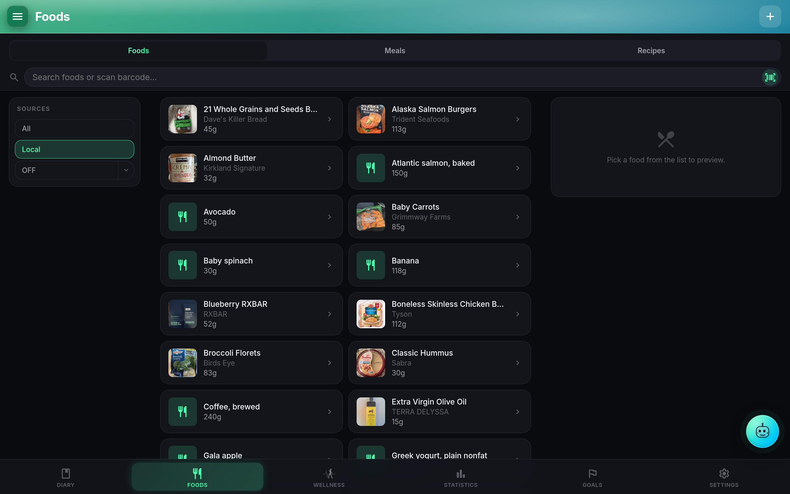

# Foods, meals & recipes

The **Foods** page is the library. Three tabs across the top: **Foods**, **Meals**, **Recipes**. A search field, source filter chips, and (per your sort setting) either favorites-first or an alphabetical / recently-used / most-used list. Everything the Diary picker touches lives here first.

## Personal food database

Each food row carries a name, brand, category, custom labels, photo, barcode, notes, per-serving nutrition, and optional per-100g nutrition (or per-100ml for liquids). Storage is the `foods` table (`server/db.js:27-40`). Foods you create are private by default; visibility can be raised to Everyone or Specific users (see **Sharing** below).

**Favorites** are a per-user star. Sort behavior for each tab is independent (`foodsSort`, `mealsSort`, `recipesSort`) and covers:

- **Favorites first**: starred rows at the top, everything else alphabetical.
- **Alphabetical**: flat A-Z.
- **Recently used**: most recent `POST /api/foods/:id/used` timestamp first.
- **Most used**: highest usage count first.

Search is fuzzy: edit distance 1 for words of four or more characters (`Foods.svelte#_fuzzyMatch`). Typos are forgiven; short words are matched exactly to avoid noise.

## Source filter chips

Across the top of the picker: **Local / OFF / USDA / Mealie / From Others**. Single-tap scopes to one source; long-press combines. A per-row source badge marks the origin in the combined view.

**Per-source tier filters** narrow further:

- **OFF completeness bucket**: full / partial / stub.
- **USDA data type**: Foundation / SR Legacy / Survey / Branded / Experimental.

Both are client-side filters (no extra API calls) and were added in 1.0.3. Every OFF result carries an **origin-country flag** and a **completeness dot**; every USDA result carries a **data-type badge**. See [Food data quality signals](../reference/food-data-quality.md) for what each signal means and when to trust each tier.

## Barcode scanner

Camera-based scanner using Open Food Facts on web (QuaggaJS) and native `@capacitor-mlkit/barcode-scanning` on Android, with Google Code Scanner as fallback. Toggles: `barcodeBeep` (audio confirmation), `barcodeFlashlight` (device-only, per-device pref, does not sync).

**Unknown barcodes** open the food editor prefilled with the barcode field so you can enter the food manually and contribute back. If you have OFF account credentials set (Settings → Connected Services → Open Food Facts), the food editor's **Share to Open Food Facts** button uploads your entry (with photo) to the OFF community database. The button flips to "View on OFF" when the product already exists, opening the OFF wiki page where edits properly track history and moderation.

## Scan Label (AI OCR)

When AI Assistant is enabled and configured with a vision-capable model, a **Scan Label** button appears on the Nutrition card in the food editor. Tap it, snap a photo of the actual nutrition label (Nutrition Facts panel or its regional equivalent), and the whole panel is sent to your configured AI provider. Every field it extracts (calories, macros, micros, serving size) is filled in one tap.

Photo goes over the AI chat pipe as base64 (12 MB body limit, `server/index.js:76`). Works with Claude, OpenAI, Gemini, and any OpenAI-compatible endpoint that supports vision (Ollama with a multimodal model, vLLM, and so on). See [Trace in NutriTrace](trace.md).

## Meal and recipe builder

Meals and recipes share the same table (`is_recipe=1` for recipes, `server/db.js:42-55`). The builder is a drag-to-reorder list of ingredients. Each ingredient carries its quantity, unit, and optional notes; nutrition scales proportionally when you edit the serving size.

**Recipe yields** split a saved recipe into N servings. Each child food is automatically scaled to one portion, so logging "one serving of chili" pulls the right macros regardless of whether the recipe was built at 4 servings or 6.

Copy, share, and favorite behavior mirrors foods exactly.

## Configurable nutrient order

**Settings → Nutrients** is a drag-to-reorder list of everything the app tracks: the macros, the standard micros, and any custom nutrients you add. The order applies everywhere nutrition is displayed (food editor, meal editor, Nutrition Summary sheet, Statistics chip row). Hidden nutrients drop off the display but stay in the DB so historical data does not disappear.

Custom nutrients live under `customNutriments` in your user settings.

## Import from Open Food Facts / USDA / Mealie

Each source is a per-user toggle under **Settings → Connected Services**:

- **Open Food Facts**: no key, on by default. Barcode and name lookups; per-serving vs per-100g preference when both are published; optional OFF account credentials for the Share-to-OFF button and per-user language / country biasing. See [Open Food Facts](off.md) for the local-mirror setup.
- **USDA FoodData Central**: free API key required (`usdaEnabled`, `usdaApiKey`). Per-source data-type badge on results.
- **Mealie**: self-hosted recipe manager integration. `mealieEnabled`, `mealieBaseUrl`, `mealieApiToken`. Server proxies via `POST /api/mealie/proxy`; the token never touches the browser.

Import from any source lands the food in your Local catalog with a `source` tag preserved for provenance.

## Mass-aware unit conversion

Switching g ↔ oz ↔ lb, ml ↔ cup, tsp ↔ tbsp, or any custom unit you define **converts the macros**, not just the label. Container density (for volume ↔ mass) is inferred from the food where available and falls back to standard tables. Custom units live under `customUnits` in your user settings and are user-scoped, so household members can define their own.

The `warnOnUnitMismatch` toggle surfaces a warning when a logged unit does not match the source food's original unit (for example, logging a per-100g food in cups without density set). Turn it off if you know what you are doing and the warnings are noisy.

## Bulk import (JSON / CSV)

**Settings → Import & Export → Bulk Import** takes a JSON or CSV of custom foods and inserts them into your Local catalog. The endpoint is `server/routes/nutrition-import.js` and the format is documented inline in the Import panel with a downloadable template.

For importing past **days** (not foods), the same panel has the MFP / Lose It / Cronometer / generic-CSV import flow. Preview endpoint returns what would be committed; commit takes a per-date conflict policy (`overwrite`, `merge`, `skip`) before writing.

## Sharing foods between users

Any food or meal you create can be shared **private / everyone / specific users**. Row-level grants live in `food_shares` / `meal_shares`. Recipients see the food under the **From Others** source chip and can either add it to a diary directly or **copy** it into their own catalog (`POST /api/foods/:id/copy`), which decouples the copy from the original owner.

The `defaultFoodVisibility` per-user setting sets what happens by default when you create a new food. Bulk share and bulk unshare live under **Settings → Sharing**.

Wellness data is never shared; it stays strictly per-user.

## Related

- [Diary & meal logging](diary.md)
- [Open Food Facts](off.md)
- [USDA & Mealie integration](usda-mealie.md)
- [Barcode & Scan Label](scan.md)
- [Trace in NutriTrace + Smart Log](trace.md)
