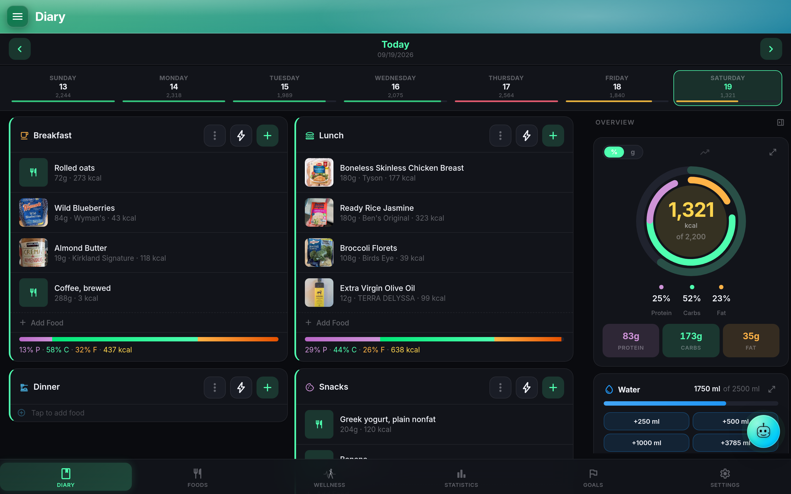

# NutriTrace

NutriTrace is a self-hosted personal nutrition tracker. It runs as a single Docker container on your own hardware, with a Svelte PWA in the browser and a native Android app for your phone. There is no cloud tenant, no telemetry, no analytics, and no account on any NutriTrace-run service. Third-party integrations (Open Food Facts / OFF, USDA, Fitbit via Google Health, Withings, Garmin, Mealie, an LLM provider, SMTP, push services) are all opt-in and configured per user or per instance.

The pitch is short. If you have ever used MyFitnessPal, Cronometer, MacroFactor, or Lose It and thought "I want that, but on my NAS", NutriTrace is what that looks like: a full daily diary with configurable meals, a personal food and recipe library, barcode and label scanning, wearable-informed calorie goals with an inspectable Adaptive TDEE algorithm, a wellness dashboard that pulls from Fitbit / Withings / Garmin / Health Connect, and an in-app AI assistant (Trace) that reads your actual data via tool use rather than making things up.

## Honest comparisons

**vs MyFitnessPal.** NutriTrace is ad-free, subscription-free, and un-monetizable (AGPL-3.0). The food database is your own foods plus live Open Food Facts and USDA lookups, not MFP's crowdsourced-and-noisy catalog. Barcode scanning works. Recipe builder works. What NutriTrace does not give you is MFP's social layer or its 20-year corpus of user-submitted foods.

**vs Cronometer.** Cronometer's micronutrient depth is excellent; NutriTrace surfaces the same fields but leans on Open Food Facts and USDA data rather than a curated in-house database. In exchange, everything is self-hosted and the AI assistant can talk to your diary, wellness data, and goals directly through tool use.

**vs MacroFactor.** MacroFactor's Adaptive TDEE was the inspiration for the Adaptive mode in Goals. The NutriTrace implementation lives in `server/lib/adaptive-tdee.js` and is fully inspectable: 35-day intake plus weight regression, 7,700 kcal per kg, 21-day readiness gate, exposed confidence score. MacroFactor still has the polish of a dedicated commercial product; NutriTrace has "you own the algorithm."

**vs Lose It.** Lose It treats wearables as a companion; NutriTrace treats wellness (sleep, HRV, readiness, resilience, workouts) as first-class data with its own dashboard and its own influence on the Dynamic calorie goal. Lose It has a slicker onboarding. NutriTrace has a first-run Wizard that runs the Mifflin-St Jeor math and hands you a starting goal without a signup form.

## What you get

- **Diary** with configurable meal slots, per-day notes, water tracking, body stats, an Activity section for manual workouts, and an Intermittent Fasting widget with presets.
- **Foods, meals, and recipes** with photos, barcodes, favorites, source filter chips (Local / OFF / USDA / Mealie / From Others), and mass-aware unit conversion.
- **Goals** in three modes: Fixed, Dynamic (from yesterday's wearable-measured burn), or Adaptive (learned).
- **Wellness** sync from Fitbit (via Google Health), Withings, Garmin, and Health Connect, with Trace-computed Sleep, Readiness, and Resilience scores.
- **Trace AI** with tool use across Claude, OpenAI, Gemini, or any OpenAI-compatible endpoint (Ollama, LM Studio, LocalAI, vLLM, DeepSeek, Groq, Together, Mistral, OpenRouter).
- **Multi-user** with OIDC SSO, optional per-food and per-meal sharing, and an admin surface for invites, backups, and provider configuration.
- **Federation API** (`/api/v1`) with scoped bearer tokens; LiftTrace posts workout kcal to NutriTrace via this path.

## Where to next

- New self-hoster: start with the shared [environment reference](../self-hosting/env-vars.md) and come back for the [feature tour](features.md).
- Coming from another tracker: [Migrate from MyFitnessPal](migrate-mfp.md) or [Migrate from Lose It / Cronometer / Waistline](migrate-other.md).
- Setting up Trace: read [Trace in NutriTrace + Smart Log](trace.md), then the shared [provider setup](../trace/setup.md).
- Wiring up wearables: [Wellness & wearables](wellness.md) is the map; [Fitbit → Google Health migration](google-health.md) is the walkthrough most existing users need.

## Related

- [Feature tour](features.md)
- [Settings reference](settings.md)
- [NutriTrace env vars](env-vars.md)
